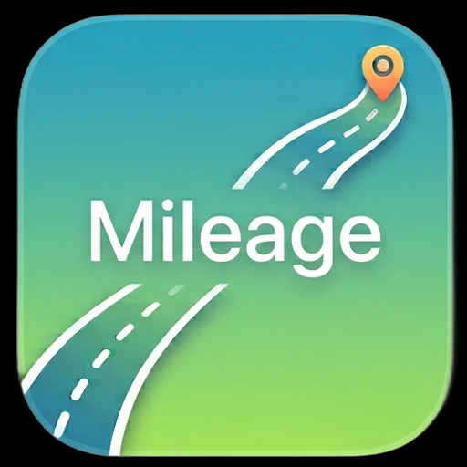
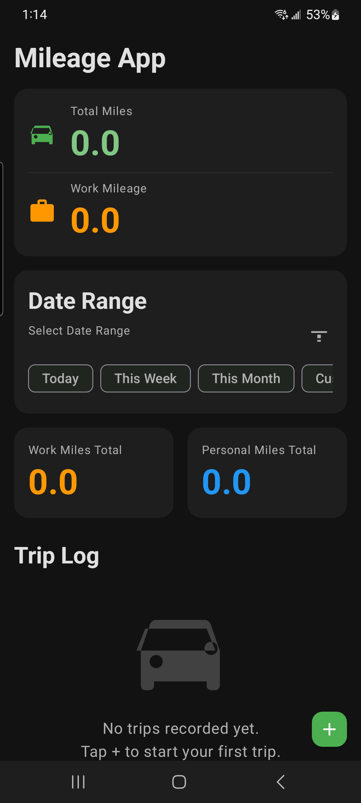

# Mileage App

GPS mileage tracker for Android. Press **Start**, drive, press **Stop** — the app
measures the trip distance and logs it with purpose and work/personal tagging.

 

## Features

- **GPS trip tracking** — foreground location service (`FusedLocationProviderClient`,
  5 s updates) with accuracy/drift filtering, live mileage + elapsed time in the
  app banner, notification, and lock-screen-safe ongoing notification with Stop action
- **Trip log** — date-range filters (today / week / month / custom), purpose filter,
  work vs. personal totals and per-trip detail/delete
- **Offline-first** — trips stored in local SQLite, no account or network needed
- **Dark Material 3 UI** with custom launcher icon

## Requirements

- Android 7.0 (API 23)+, best on Android 10+
- Google Play services (for location)
- Precise location + notification permissions (requested in-app)
- JDK 17 and Android SDK 34 to build

## Quick start

```bash
git clone https://github.com/craigmcgrain-spec/Mileage-App.git
cd Mileage-App
./gradlew assembleDebug
adb install -r app/build/outputs/apk/debug/app-debug.apk
```

Or open the project in Android Studio and press **Run**.

A prebuilt signed release APK is in [`releases/Mileage-App-v1.0.apk`](releases/Mileage-App-v1.0.apk).

## Release signing

Release builds read the signing key from `~/.gradle/gradle.properties`
(never committed):

```properties
MILEAGE_STORE_FILE=/home/<you>/.android/mileage-release.keystore
MILEAGE_STORE_PASSWORD=<store password>
MILEAGE_KEY_ALIAS=mileage
MILEAGE_KEY_PASSWORD=<key password>
```

Without these properties the release build falls back to the debug key.
Generate a key with:

```bash
keytool -genkeypair -keystore ~/.android/mileage-release.keystore \
  -alias mileage -keyalg RSA -keysize 2048 -validity 10000
```

Note: PKCS12 keystores require the key password to equal the store password.

```bash
./gradlew assembleRelease   # app/build/outputs/apk/release/app-release.apk
```

## Permissions

| Permission | Why |
|---|---|
| `ACCESS_FINE_LOCATION` / `ACCESS_COARSE_LOCATION` | Measure distance while driving |
| `FOREGROUND_SERVICE_LOCATION` | Location tracking in a foreground service |
| `POST_NOTIFICATIONS` | Ongoing tracking notification with Stop action |

## Project structure

```
app/src/main/
  java/com/mileage/app/
    MainActivity.java          # trip list, filters, start/stop flow, live banner
    MileageApplication.java    # app singleton, repository wiring
    service/TripService.java   # foreground GPS tracking, broadcasts
    data/                      # Trip model, SQLite helper + repository
    adapter/TripAdapter.java   # trip list UI
  res/                         # layouts, Material 3 theme, launcher icons
```

## Versions

- **v1.0** — GPS Start/Stop tracking, trip log with filters, custom icon
